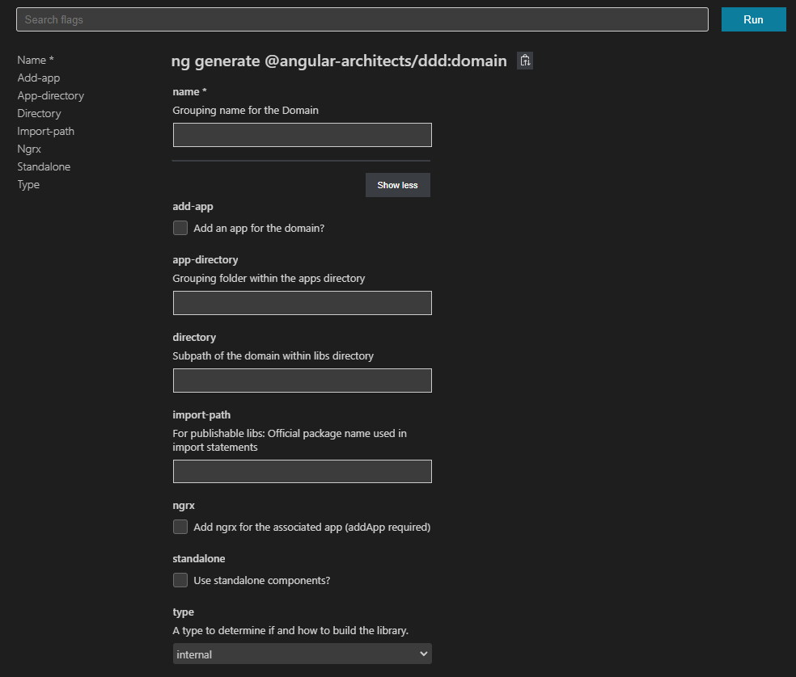
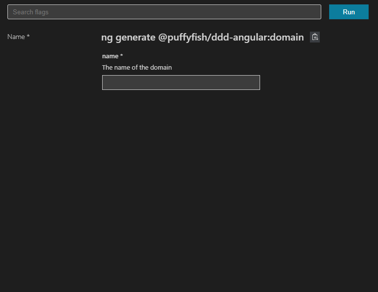

# NxGeneratorz

This is a project containing generators based off of the amazing [@angular-architects/ddd](https://www.npmjs.com/package/@angular-architects/ddd) package.

It's intent is to simplify the usage of the existing generators, from looking like this:

To something like this!

Helps keep the "Do I want my domain to be internal, buildable or publishable?" questions away ;)

We mostly hide the options that are available via the DDD generators. This means that most options are defaulted to false, such and including NGRX, or having any sort of custom pathing.

Global defaults:

- standalone = false
- type = buildable
- When required, domains are available via project dropdown, and verify that the selected project has a `type:domain-logic` tag

| Generator | Default Options                                                                                                   |
| --------- | ----------------------------------------------------------------------------------------------------------------- |
| Domain    | `format = {name}-domain`                                                                                          |
| Feature   | `format = feature-{name}`   `noApp = true`                                                                     |
| UI-domain | `format = {domainName}-ui-{name}`   `shared = false`                                                           |
| UI-shared | `format = shared-ui-${name}`   `shared = true`                                                                 |
| Util      | `format = shared-util-${name}`   `shared = true`                                                               |
| API       | `format = {domainName}-api-${name}`                                                                               |
| Shell     | `format = {domainName}-shell-${name}`   `directory = domainName`   t`ags = [domain:{domain}, 'type:shell']` |

The rename generator does not currently take boundaries into account, so tags must be manually adjusted.

## Things to come

- ???
- Adding certain optionals (NGRX, and standalone components)
